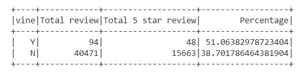

# Amazon_Vine_Analysis

## Overview
We were tasked with analyzing data on Amazon Video Game Reviews. We were specifically tasked with determining if there was any bias in reviews based on whether or not the reviewer was part of a paid review program (Vine) or unpaid (just regular reviews). We linked to the amazon reviews dataset, stored the data in a dataframe and ran our analysis. The results are as follows.

## Analysis

We first created a Summary of the reviews that were a part of the Vine program:

Next we created a Summary of the reviews that were NOT a part of the Vine program:

We can see that there are a significantly higher number of reviews that are unpaid vs. paid. We need to determine how this affects the 5 star rating to determine if there is any bias toward ratings.

### Bias Analysis

We first determined the percentage of 5 star reviews for both paid and unpaid reviews based on a dataframe we created where the number of helpful_votes divided by total_votes is equal to or greater than 50%.

We can see from this graphic that the percentage of 5 star reviews for paid reviewers is significantly higher than that of the unpaid reviewers.

After running an analysis to determine the total number of Vine reviews verses Non-Vine reviews we get the below results.

## Summary

Based on the results of the data around 51% of the paid (Vine) users give five star reviews while around 38% of the unpaid (Non-Vine) users give five star reviews. This would lead us to conclude that there is some bias in reviews for paid reviewers vs. unpaid. An additional alanysis we could perform would be to analyze the statistical distribution of the ratings for the Vine vs. Non-Vine reviewers.
